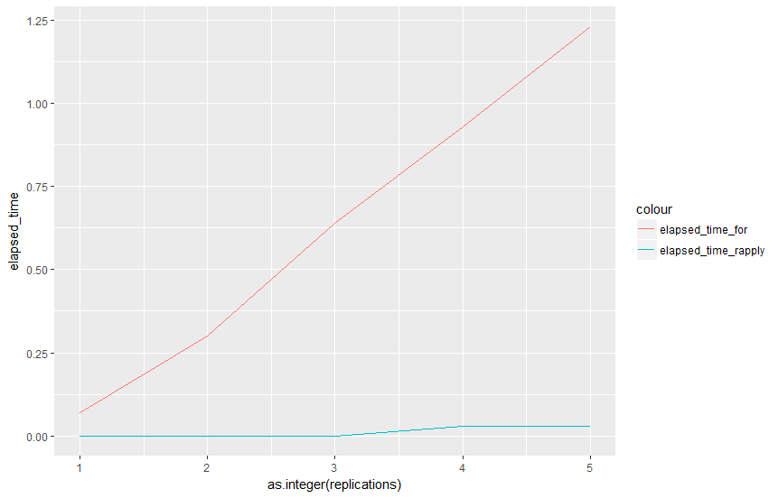

# apply functions in R

In this assignment, I have compared performance of each loop to each corresponding apply function.
These are the apply functions i have used : mapply, tapply and rapply.


-----

# libraries used: 
library(rbenchmark): to measure the performance.

library(ggplot2): to plot the graph.


--------

# 1. mapply:
mapply is a multivariate version of sapply. mapply applies FUN to the first elements of each … argument, the second elements, the third elements, and so on. 

To measure the performance of mapply, i am replicating it for 100,500,1000,1500,2000 times.

after using benchmark function, we are interested in the elapsed_time, which is in the [3] column
```
rep <- c(100,500,1000,1500,2000)
for(i in rep){
  tmp <- benchmark(mapply(sum, l1$a, l1$b), replications = i)[3]
  performance_mapply <- rbind(performance_mapply, data.frame(as.character(i), tmp))
}
```
Similarly, we measure the performance of for loop.

Later combine performance of mapply and for loop.
```
performance_final <- cbind(performance_tapply, performance_for$elapsed_time_for)
names(performance_final)[3] <- "elapsed_time_for"
```
Plot the graph
```
ggplot(performance_final, aes(x = as.integer(replications))) + 
  geom_line(aes(y = elapsed_time, colour = "elapsed_time_tapply")) + 
  geom_line(aes(y = elapsed_time_for, colour = "elapsed_time_for"))
```


-------
# 2. rapply:
rapply is a recursive version of lapply.

To measure the performance of rapply, i am replicating it for 100,500,1000,1500,2000 times.

after using benchmark function, we are interested in the elapsed_time, which is in the [3] column
```
for(i in rep){
  tmp <- benchmark(rapply(l1,log2), replications = i)[3]
  performance_rapply <- rbind(performance_rapply, data.frame(as.character(i), tmp))
}
```
Similarly, we measure the performance of for loop.

Later combine performance of rapply and for loop.
```
performance_final <- cbind(performance_rapply, performance_for$elapsed_time_for)
names(performance_final)[3] <- "elapsed_time_for"

```
Plot the graph
```
ggplot(performance_final, aes(x = as.integer(replications))) + 
  geom_line(aes(y = elapsed_time, colour = "elapsed_time_rapply")) + 
  geom_line(aes(y = elapsed_time_for, colour = "elapsed_time_for"))
```


-------

# 3. tapply:
tapply() applies a function or operation on subset of the vector broken down by a given factor variable. 

To measure the performance of tapply, i am replicating it for 100,500,1000,1500,2000 times.

after using benchmark function, we are interested in the elapsed_time, which is in the [3] column
```
rep <- c(100,500,1000,1500,2000)
for(i in rep){
  tmp <- benchmark(mapply(sum, l1$a, l1$b), replications = i)[3]
  performance_mapply <- rbind(performance_mapply, data.frame(as.character(i), tmp))
}
```
Similarly, we measure the performance of for loop.

Later combine performance of mapply and for loop.
```
performance_final <- cbind(performance_tapply, performance_for$elapsed_time_for)
names(performance_final)[3]<- "elapsed_time_for"
```
Plot the graph
```
ggplot(performance_final, aes(x = as.integer(replications))) + 
  geom_line(aes(y = elapsed_time, colour = "elapsed_time_tapply")) + 
  geom_line(aes(y = elapsed_time_for, colour = "elapsed_time_for"))
```


